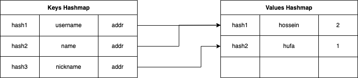

# KVS Architecture

here is a brief explanation of how the code is designed to perform `get`/`set`/`delete` and `count` of `values` operations.

to achieve the best performance for those operations I used two `std::map` one of which stores the keys and the reference to the second `map` which stores the values and number of referenced items.

so in this case all operations have logarithmic complexity.

### CLI
for other parts of the code, some design patterns were applied to bring more flexibility and extensibility for future development

* Factory Method for running the proper command
* Command Pattern for encapsulating the command to be executed
* Chain of responsibility for validating the inputs
* Singleton for instantiating DB manager